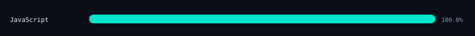
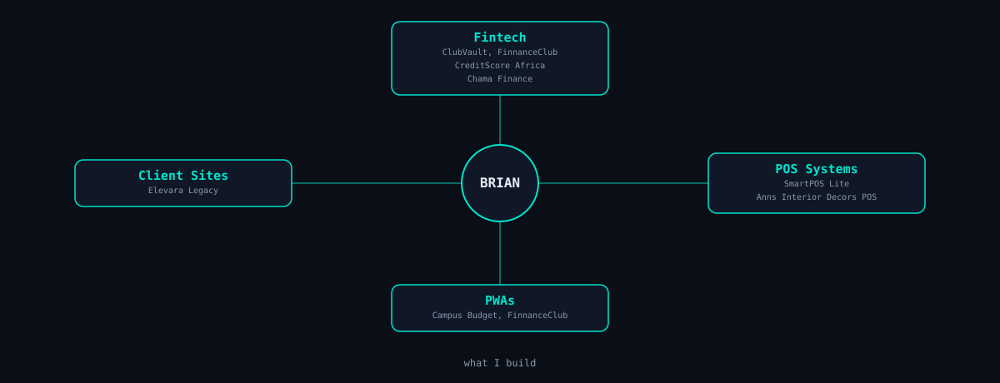

## Skills

## Language activity

## Contribution graph

## Recent builds

<!-- PROJECTS:START -->
<!-- This section is updated automatically by .github/workflows/update-profile.yml — don't edit by hand -->
| Project | Description | Language | ⭐ |
|---|---|---|---|
| [**rental-tracker**](https://github.com/BRIAN-pixel275/rental-tracker) | A CLI app for tracking your own rentable items — listing, renting out, and confirming returns — built on a five-layer architecture over SQLite. | Java | 0 |
| [**time-window-filter-**](https://github.com/BRIAN-pixel275/time-window-filter-) | — | Java | 1 |
| [**trace-finder**](https://github.com/BRIAN-pixel275/trace-finder) | TraceFinder is a Java command-line application that analyzes access logs using a CSV-based rulebook. It identifies normal activity, flags entries with higher severity levels, detects unknown activity patterns, and reports malformed log lines. | Java | 0 |
| [**kukisa-registration**](https://github.com/BRIAN-pixel275/kukisa-registration) | A mobile-first web application designed to help the Kenyatta University Kiambu Students Association (KUKISA) register and collect information from new students from Kiambu County. | JavaScript | 1 |
| [**creditscoreAfrica**](https://github.com/BRIAN-pixel275/creditscoreAfrica) | — | — | 0 |
| [**portfolio**](https://github.com/BRIAN-pixel275/portfolio) | portfolio website for a software engineer | CSS | 0 |
| [**elevara-legacy**](https://github.com/BRIAN-pixel275/elevara-legacy) | A modern, responsive women empowerment platform built with React, Vite, and Supabase, featuring programs, community engagement, events, contact management, and an admin dashboard. | JavaScript | 1 |
| [**HospitalManagementSystem**](https://github.com/BRIAN-pixel275/HospitalManagementSystem) | A full-stack hospital management system for managing data and patients records | Java | 0 |
<!-- PROJECTS:END -->

Last synced: <!-- LAST_UPDATED:START -->2026-09-23 16:22 UTC<!-- LAST_UPDATED:END -->
